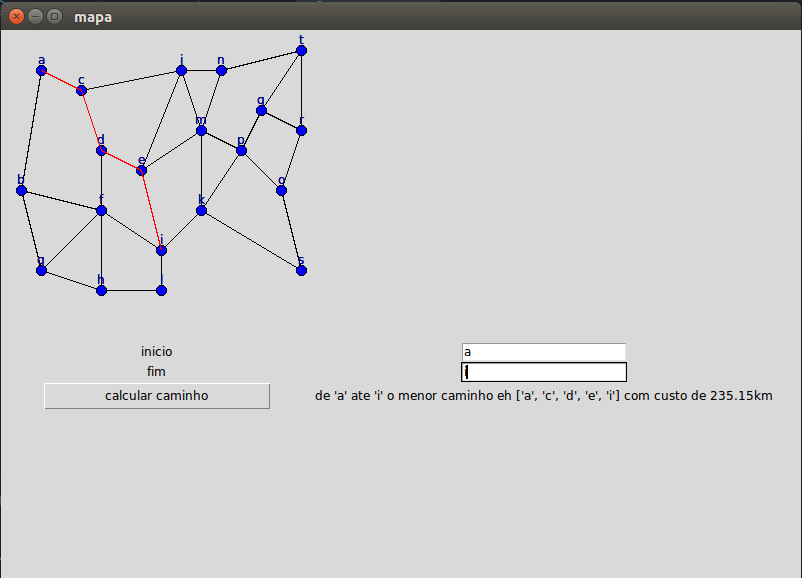

# projeto2_grafo_marcelo_araujo

Aluno: Marcelo Araújo dos Santos
Matrícula: 16/0035481

Para baixar o programa:
* git clone https://github.com/projeto-de-algoritmos/projeto2_grafo_marcelo_araujo

Para rodar o programa:
* python3 projeto.py

Veja um exemplo:

É necessário ter instalado o [tkinter](https://tkdocs.com/tutorial/install.html)

